# Awesome Python Course (Beginners To Advance)

| Beginner's Module|
|:---------------------------------------------------------------------:|
_________________________________________________________________________

| Sn.no |  Topics |
|------|:---------------------------------------------------------:|
| 01  |  [Introduction to Python](./readme.md)|
| 02  |  [Reserved keywords, Variables, Expressions]()|
| 03  |  [Operators]()|
| 04  |  [Introduction to Python Data Types, Using Comments in Python]()|
| 05  |  [Conditional Statements and Recursion]()|
| 06  |  [Looping Statements]()|
| 07  |  [Number System and Conversions]()|
| 08  |  [String]()|
| 09  |  [List]()|
| 10  |  [Tuple]()|
| 11  |  [Dictionary]()|
| 12  |  [Set]()|
| 13  |  [Functions]()|
| 14  |  [List Comprehension]()|
| 15  |  [Modules]()|
| 16  |  [Arrays]()|
| 17  |  [Higher Order Functions]()|
| 18  |  [File Handling in Python]()|
| 19  |  [Python Date and Time]()|
| 20  |  [Regular Expression]()|


________________________________________________________________________
| Intermediate Module|
|:---------------------------------------------------------------------:|
_________________________________________________________________________

| Sn.no |  Topics |
|------|:---------------------------------------------------------:|
| 21  |  [Object Oriented Programming in Python]()|
| 22  |  [Errors and Exception Handling in Python]()|
| 23  |  [Multithreading in Python]()|
| 24  |  [Python synchronization]()|
| 25  |  [Networking and Security Programming With Python]()|
| 26  |  [Python package Manager - PIP]()|
| 27  |  [Python GUI Programming]()|
| 28  |  [XML Processing in Python]()|
| 🚩  |  Programming With External Libraries|
| 29  |  [OS Module]()|
| 30  |  [Sending Email - smptlib ]()|
| 31  |  [wikipedia module]()|
| 32  |  [Web Scraping]()|
| 33  |  [Text to Speech Synthesis - pyttsx3, gTTS, CoquiTTS, Larynx]()|
| 34  |  [Speech Recognition - SpeechRecognition, google-cloud-speech,]()|
| 35  |  [Language Transulator - googletrans]()|
| 36  |  [Internet Search Engine Modules]()|
| 37  |  [JSON]()|
| 38  |  [pygame, pyaztro]()|
| 39  |  [Authentication in Python]()|
| 40  |  [Geolocation - GPS Tracking]()|
| 🚩  |  (DSA) Data Structure and Algorithms in Python|
| 41  |  [DSA Introduction]()|
| 42  |  [Data Structures part-1]()|
| 43  |  [Data Structures part-2]()|
| 44  |  [Tree Based DSA - 1]()|
| 45  |  [Tree Based DSA - 2]()|
| 46  |  [Graph Based DSA - 1]()|
| 47  |  [Sorting and Searching Algorithms ]()|
| 48  |  [Greedy Algorithms ]()|
| 49  |  [Dynamic Programming]()|
| 50  |  [Other Algorithms]()|
| 🚩  |  Databases in Python|
| 51  |  [Introduction To Database]()|
| 52  |  [SQLite]()|
| 53  |  [SQLAlchemy]()|
| 54  |  [MySQL and PostgreSQL]()|
| 55  |  [MongoDB]()|


________________________________________________________________________
| Advance Module|
|:---------------------------------------------------------------------:|
_________________________________________________________________________

| Sn.no |  Topics |
|------|:---------------------------------------------------------:|
| 🚩  |  Data Science & Deep Learning |
| 56  |  [Introduction to Data Science]()|
| 57  |  [Pandas]()|
| 58  |  [Numpy]()|
| 59  |  [Data Processing]()|
| 60  |  [Dta Visualization]()|
| 61  |  [Statistical Data Analysis]()|
| 62  |  [Machine Learning]()|
| 63  |  [Feature Engineering]()|
| 64  |  [OpenCV]()|
| 65  |  [TensorFlow]()|
| 66  |  [Keras and Pytorch]()|
| 67  |  [Mathematics For Deep Learning]()|
| 68  |  [Neural Networks Fundamentals]()|
| 69  |  [Deep Learning Architectures]()|
| 70  |  [Natural Language Processing]()|
| 71  |  [Deep Learning Model Implementation]()|
| 72  |  [Practical Deep Learning Projects]()|
| 🚩  |  Python Web Development|
| 73  |  [Introduction to Python Web Development - Web Basics]()|
| 74  |  [Virtual Environment]()|
|   |  **FLASK** |
| 75  |  [Introduction To Flask]()|
| 76  |  [Application Structure and Setup]()|
| 77  |  [Templates and Static Files]()|
| 78  |  [URL Routing,Accessing Request Data and Responces]()|
| 79  |  [Working with Database]()|
| 80  |  [Cookies and Sessions]()|
| 81  |  [Redirecting and errors,Error Handling in Flask]()|
| 82  |  [Classes and Function Implemntation in Flask]()|
| 83  |  [Message Flashing, File Uploading, Extension]()|
| 84  |  [Flask Mail, WTF, Sijax]()|
| 85  |  [Working With API]()|
| 86  |  [Flask Deployment and FastCGI]()|
|   |  **Django** |
| 87  |       [Django Web Framework (Python): Introduction]()|
| 88  |       [Setting up a Django development environment]()|
| 89  |       [The Local Library website]()|
| 90  |       [Creating a skeleton website]()|
| 91  |       [Using models]()|
| 92  |       [Django admin site]()|
| 93  |       [Creating home page]()|
| 94  |       [Generic list and detail views]()|
| 95  |       [Sessions framework]()|
| 96  |       [User authentication and permissions]()|
| 97  |       [Working with forms]()|
| 98  |       [Testing a Django web application]()|
| 99  |       [Deploying Django to production]()|
| 100  |       [Django web application security]()|
| 🚩  |  Deployment and Web Hosting|
| 101  |       [Deployment Overview]()|
| 102  |       [AWS]()|
| 104  |       [Azure]()|
| 105  |       [GCP]()|
| 106  |       [web-Hosting:Render, Heroku]()|

Start Learning 🚀
<div>
    <h1>Awesome Python Course: Beginner's Module - 01.Introduction to Python </h1>
    <a href='https://www.linkedin.com/in/vijay-anand-b-732075294'><svg xmlns="http://www.w3.org/2000/svg" width="16" height="16" fill="currentColor" class="bi bi-linkedin" viewBox="0 0 16 16">
  <path d="M0 1.146C0 .513.526 0 1.175 0h13.65C15.474 0 16 .513 16 1.146v13.708c0 .633-.526 1.146-1.175 1.146H1.175C.526 16 0 15.487 0 14.854V1.146zm4.943 12.248V6.169H2.542v7.225h2.401zm-1.2-8.212c.837 0 1.358-.554 1.358-1.248-.015-.709-.52-1.248-1.342-1.248-.822 0-1.359.54-1.359 1.248 0 .694.521 1.248 1.327 1.248h.016zm4.908 8.212V9.359c0-.216.016-.432.08-.586.173-.431.568-.878 1.232-.878.869 0 1.216.662 1.216 1.634v3.865h2.401V9.25c0-2.22-1.184-3.252-2.764-3.252-1.274 0-1.845.7-2.165 1.193v.025h-.016a5.54 5.54 0 0 1 .016-.025V6.169h-2.4c.03.678 0 7.225 0 7.225h2.4z"/>
</svg></a>
<a href='https://www.instagram.com/spidy_152003?utm_source=qr'><svg xmlns="http://www.w3.org/2000/svg" width="16" height="16" fill="currentColor" class="bi bi-instagram" viewBox="0 0 16 16">
  <path d="M8 0C5.829 0 5.556.01 4.703.048 3.85.088 3.269.222 2.76.42a3.917 3.917 0 0 0-1.417.923A3.927 3.927 0 0 0 .42 2.76C.222 3.268.087 3.85.048 4.7.01 5.555 0 5.827 0 8.001c0 2.172.01 2.444.048 3.297.04.852.174 1.433.372 1.942.205.526.478.972.923 1.417.444.445.89.719 1.416.923.51.198 1.09.333 1.942.372C5.555 15.99 5.827 16 8 16s2.444-.01 3.298-.048c.851-.04 1.434-.174 1.943-.372a3.916 3.916 0 0 0 1.416-.923c.445-.445.718-.891.923-1.417.197-.509.332-1.09.372-1.942C15.99 10.445 16 10.173 16 8s-.01-2.445-.048-3.299c-.04-.851-.175-1.433-.372-1.941a3.926 3.926 0 0 0-.923-1.417A3.911 3.911 0 0 0 13.24.42c-.51-.198-1.092-.333-1.943-.372C10.443.01 10.172 0 7.998 0h.003zm-.717 1.442h.718c2.136 0 2.389.007 3.232.046.78.035 1.204.166 1.486.275.373.145.64.319.92.599.28.28.453.546.598.92.11.281.24.705.275 1.485.039.843.047 1.096.047 3.231s-.008 2.389-.047 3.232c-.035.78-.166 1.203-.275 1.485a2.47 2.47 0 0 1-.599.919c-.28.28-.546.453-.92.598-.28.11-.704.24-1.485.276-.843.038-1.096.047-3.232.047s-2.39-.009-3.233-.047c-.78-.036-1.203-.166-1.485-.276a2.478 2.478 0 0 1-.92-.598 2.48 2.48 0 0 1-.6-.92c-.109-.281-.24-.705-.275-1.485-.038-.843-.046-1.096-.046-3.233 0-2.136.008-2.388.046-3.231.036-.78.166-1.204.276-1.486.145-.373.319-.64.599-.92.28-.28.546-.453.92-.598.282-.11.705-.24 1.485-.276.738-.034 1.024-.044 2.515-.045v.002zm4.988 1.328a.96.96 0 1 0 0 1.92.96.96 0 0 0 0-1.92zm-4.27 1.122a4.109 4.109 0 1 0 0 8.217 4.109 4.109 0 0 0 0-8.217zm0 1.441a2.667 2.667 0 1 1 0 5.334 2.667 2.667 0 0 1 0-5.334z"/>
</svg></a>
<p align='center'> Prepared by <strong>~ Vijay Anand </strong></p>
</div>

<a href='https://www.w3schools.com/howto/howto_css_round_buttons.asp'><button style='height:7vh; width:20vh; border-radius:30px; background-color:yellow;'>Next 02 ⇨</button></a>

<br>

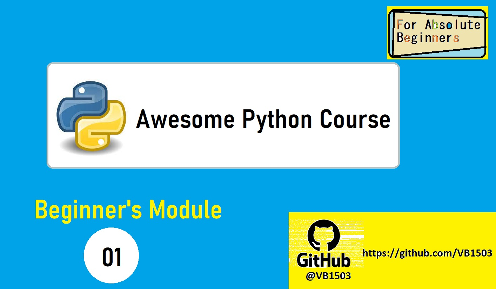

## Introduction
> Python is one of the most popular programming languages. Although it is a general-purpose language, it is used in various areas of applications such as Machine Learning, Artificial Intelligence, web development, IoT, and more.

This Awesome Python Course has been written for the beginners to help them understand the basic to advanced concepts of Python Programming Language. After completing this course you will find yourself to be more confidence and experience in python. 

## What is Python?
Python is a very popular general-purpose interpreted, interactive, object-oriented, and high-level programming language. Python is dynamically-typed and garbage-collected programming language. It was created by Guido van Rossum during 1985- 1990. Like Perl, Python source code is also available under the GNU General Public License (GPL).
* **High-level:** Python is considered a high-level programming language because it abstracts many low-level details, such as memory management and hardware-specific operations, away from the programmer. This abstraction allows developers to focus more on solving problems and writing code that is easier to read and maintain. High-level languages are designed to be user-friendly and provide a high level of abstraction from the underlying hardware.

* **General-Purpose:** Python is a general-purpose language, which means it is not specialized for a specific type of application or domain. It can be used for a wide variety of tasks, from web development and data analysis to scientific computing, artificial intelligence, scripting, and more. Python's versatility and extensive libraries make it suitable for a broad range of applications.

> Python supports multiple programming paradigms, including Procedural, Object Oriented and Functional programming language. Python design philosophy emphasizes code readability with the use of significant indentation.

## Why to Learn Python?
Python is a popular programming language for several compelling reasons, making it a preferred choice for a wide range of applications. Here are some of the key reasons why Python is a great language to learn and use:

**1) Readability and Simplicity:** Python's syntax is designed to be clean and readable, with a focus on human-friendly code. Its use of indentation for block structure forces clean and consistent code formatting, making it easier for developers to understand and maintain code.

**2) Versatility:** Python is a general-purpose programming language, meaning it can be used for almost any type of application or project. Whether you're interested in web development, data analysis, artificial intelligence, scientific computing, automation, or game development, Python has libraries and frameworks to support your needs.

**3) Large Standard Library:** Python comes with an extensive standard library that includes modules and functions for common tasks, reducing the need to write code from scratch. This library simplifies various aspects of development, such as file handling, networking, and data manipulation.

**4) Community and Documentation:** Python has a vast and active community of developers worldwide. This community contributes to the language's growth, provides extensive documentation, and offers support through forums, mailing lists, and online resources. This makes it easy to find solutions to common problems and learn from others.

**5) Cross-Platform Compatibility:** Python is available on multiple platforms, including Windows, macOS, and various Unix-like systems. Code written in Python is highly portable, allowing developers to create applications that work seamlessly across different operating systems.

**6) Interpreted Language:** Python is an interpreted language, meaning you can write and execute code directly without the need for compilation. This results in quicker development cycles and easier debugging.

**7) Dynamic Typing:** Python is dynamically typed, which means you don't need to declare variable types explicitly. This dynamic typing makes the language flexible and allows for rapid prototyping and development.

**8) Open Source:** Python is open source and freely available, encouraging collaboration and innovation. Developers can contribute to the language's development, and this openness has led to the creation of numerous third-party libraries and frameworks.

**9) Data Science and Machine Learning:** Python is a dominant language in the fields of data science and machine learning. Libraries like NumPy, pandas, scikit-learn, and TensorFlow have made it the go-to language for data analysis and artificial intelligence projects.

**10) Web Development:** Python offers powerful web development frameworks like Django and Flask, making it easy to build robust and scalable web applications.

**11) Automation and Scripting:** Python is often used for automation and scripting tasks due to its simplicity and ease of use. It's widely employed for tasks like data scraping, file manipulation, and system administration.

**12) Job Opportunities:** Python is in high demand in the job market. Learning Python can open up career opportunities in various industries, including technology, finance, healthcare, and more.

## Pythonic Code Style
Python leaves you free to choose to program in an object-oriented, procedural, functional, aspect-oriented, or even logic-oriented way. These freedoms make Python a great language to write clean and beautiful code.

**Pythonic Code Style is actually more of a design philosophy and suggests to write a code which is :**

* Clean
* Simple
* Beautiful
* Explicit
* Readable

> When Comes into Program Execution, the Program Transulator, which converts the high-level(Program code) to Low Level(Machine Understandable code 0's and 1's) are Categorized as:
* Compiler
* Interpreter
* Assembler

# Compiler
> A compiler translates the entire source code written by a programmer into machine code or an intermediate code in a single step. This translation is done before execution. The resulting executable file can be run multiple times without needing to recompile, as the translation is already complete.

> Compiled code is often platform-dependent. A program compiled for one architecture or operating system may not run on another without recompilation for the target platform.

> **Compiler:** Languages like C, C++, Rust, and Go are typically compiled languages.

# What is Interpreter ?
 > A python interpreter is a computer program that converts each high-level program statement into machine code. An interpreter translates the command that you write out into code that the computer can understand. 

 > An interpreter translates the source code line by line or statement by statement, executing each line immediately after translation. There is no separate compilation step, and the translation and execution are interleaved.

 > Interpreted languages are often more portable because the interpreter can be installed on various platforms, allowing the same source code to run on different systems without modification.

> **Interpreter:** Languages like Python, JavaScript, Ruby, and PHP are typically interpreted languages.
# Environment Setup
Python Interpreter is readily available for all leading Platforms (i.e Windows, ubuntu, MAC, unix, Palm Os, etc..)

To Run a Python Scripts first you need to Download and Install the Python Software and Other Editors.


### Installing Python on Windows

**Step 1: Download the Full Installer**

First you need to Download Python, Download the Latest Version in: https://www.python.org/downloads/


**Step 2: Run the Installer**
next, run it by double-clicking on the downloaded file.
* Tick the check box Add python.exe to PATH
* Then, Click on Install Now
* After Installing, Restart the Windows

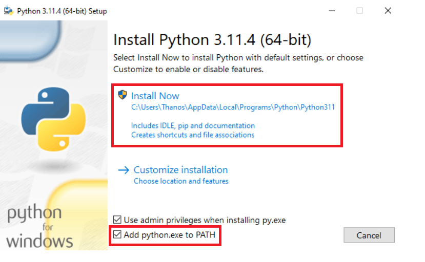

**Step 3: Verify Python Was Installed On Windows**
* open your command prompt and type `python --version` or type `python` to see the python interactive mode in command prompt.

**Step 4: Upgrade the Pip**
 Type this command `pip install --upgrade pip` to upgrade the pip
### Python Shell
-------------------------------
Python's standard library has an executable module called IDLE – short for Integrated Development and Learning Environment. Find it from Window start menu and launch.

python has two basic modes which are interactive mode and script mode

#### Interactive Mode:
The Python interactive shell is opened and it is waiting for you to write Python code(Python script). You will write your Python script next to this symbol >>> and then click Enter then it shows result in next line.

Let us do some maths first before we write any Python code:

- 5 + 2 is 7
- 4/2 is 2.0
- 5 ** 3 is same as 5 * 5 * 5
- 4 % 2 = 0 => `%` used to get remainder value of division
- 4 // 2 = 2 => returns the integer part of division quotient

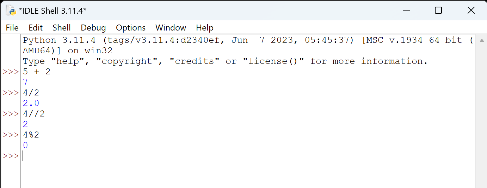

#### Script Mode
For script mode you will need to open a new file in File menu,a new python file will opened then type your python code and save it,afer that click 'run module' in run menu or simply press `F5` to Run the code, the output will shown on the idle shell.

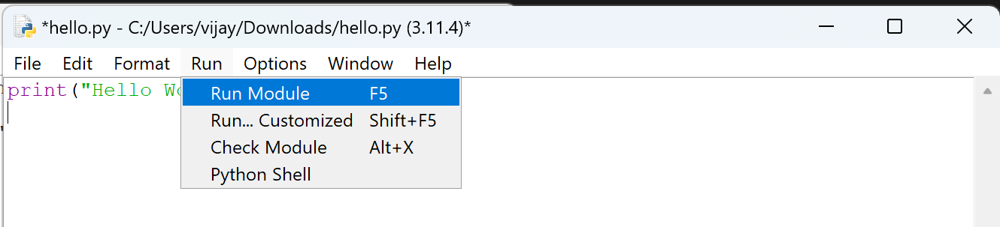
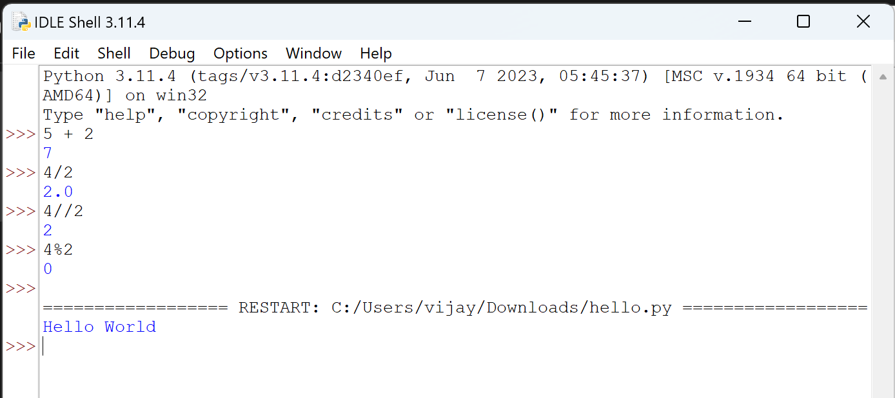

### Python in windows command prompt
On your PC press windows key + R, a run pannel will appear in that type cmd and press enter,
the command prompt will open,
*  then type `python --version` and press enter to see the downloaded version of python in your system.
* similarly use the command `pip -V` to view the version and system installed location of pip. Later on in this course we will see about pip.
* use the command `python` to run the python interactive mode in command prompt.


**create a python script file in notepad and Run it in command prompt:**
   * open the notepad
   * type your python scripts
   * go to file menu click save as,
   * choose the location then type the file name ending with `.py`  and also change the save_as_type to `All Files`
   * now your python script file is ready

Run the python script file in command prompt, by using this command `python your_file_name` 

**for example:**
```
python hello.py
```
 the above command will works only if your python script file present on the same current working directory of command prompt

if your python script file is in another disk/directory, use the command `python your_fie_location`.From the previous command instead of file name you should mention your file name along with the file path/location or else change the current working directory(CWD) to the directory where your python script file is located using system commands: `dir`- to list the directories and files in CWD, `cd ..` - move back to parent directory, `cd /d path` - to change the CWD to another specified path

for example:
 ```
 D:\> cd /d C:\Users\vijay\Downloads
 D:\> python C:\Users\vijay\Downloads\hello.py
 ```


### Installing Python on Ubuntu
--------------------------------
**Check If Python is Already Installed on Ubuntu:**
1. First, open Terminal using the “Alt + Ctrl + T” keyboard shortcut and run the below command. If the command gives an output with the version number, it means you already have Python installed in Ubuntu. To exit Python’s environment, press “Ctrl + D”. In case you get an error message like “Command not found”, you don’t have Python installed. So move to the next method to install it.
```shell
python3
```
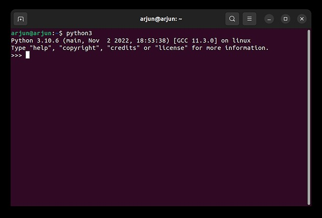

2. You can also run the below command to check the Python version on your Ubuntu installation.
```shell
python3 --version
```
3. If an older version of Python is installed, run the below command to update Python to the latest version on your Linux distro.
```shell
sudo apt --only-upgrade install python3
```
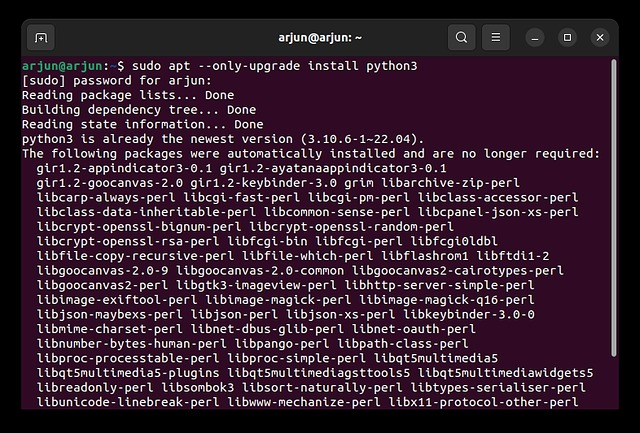

**Install Python in Ubuntu from Official Repository**
Python is available in Ubuntu’s official repository, so you don’t have to do much other than execute a simple command to seamlessly install it on your system. Here is how to do it.

1. Open Terminal in Ubuntu and run the below command to update all the packages and repositories.
```shell
sudo apt update && sudo apt upgrade -y
```
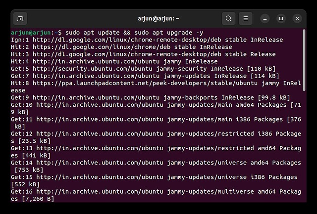

2. Next, install Python in Ubuntu by running the below command. This will automatically install Python on your machine.
```shell
sudo apt install python3
```
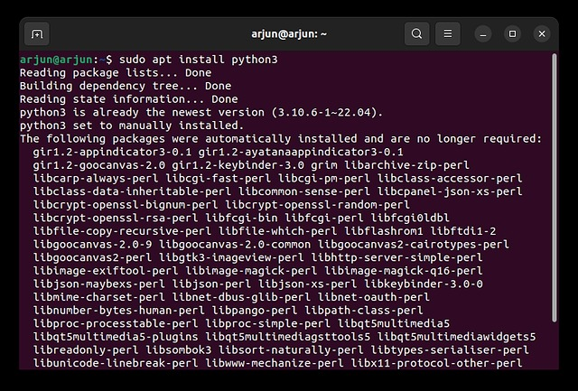

* Use the terminal command `python3` to open a python interactive mode 

**create a python script file in text editor and Run it in Terminal:**
   * open the text editor
   * type your python scripts
   * choose the location then save your file with the name ending with `.py`  and also change.
   * now your python script file is ready

Run the python script file in Terminal, by using this command `python3 your_file_name` 

**for example:**
```
python3 hello.py
```
 the above command will works only if your python script file present on the same Present working directory(PWD)

if your python script file is in another disk/directory, use the command `python3 your_fie_location`. From the previous command instead of file name you should mention your file name along with the file path/location or else change the PWD to the directory where your python script file is located using system commands: `ls`- to list the directories and files in PWD, `cd ..` - move back to parent directory, `cd /` - change the directory to root directory, `cd path` - to change the PWD to another specified path

**for example:**
 ```
 lenovo:~$ cd /home/username/Downloads
 lenovo:~$ python3 /home/username/Downloads/hello.py
 ```
 #### Working with code Editors:
 **How to Setup VScode For Python:**
 
**Step 1: Download the latest version of VsCode From** https://code.visualstudio.com/download

**Step 2: Open the downloaded setup file**

**Step 3: Accept the agreement and click next, then follow the instructions and finish the installation.**

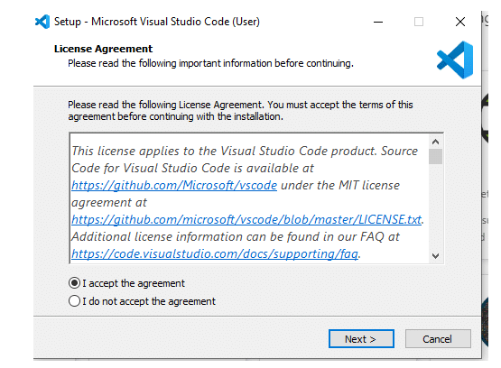

**Step 4: open the VScode and go to the extensions menu search for code runner and install it**


**Step 5: similarly install the Python Extension**


**Step 6: Now Click on the `Open Folder` select the directory where you want to store your project files.**

**Step 7: Goto File menu click the Auto Save Option.**
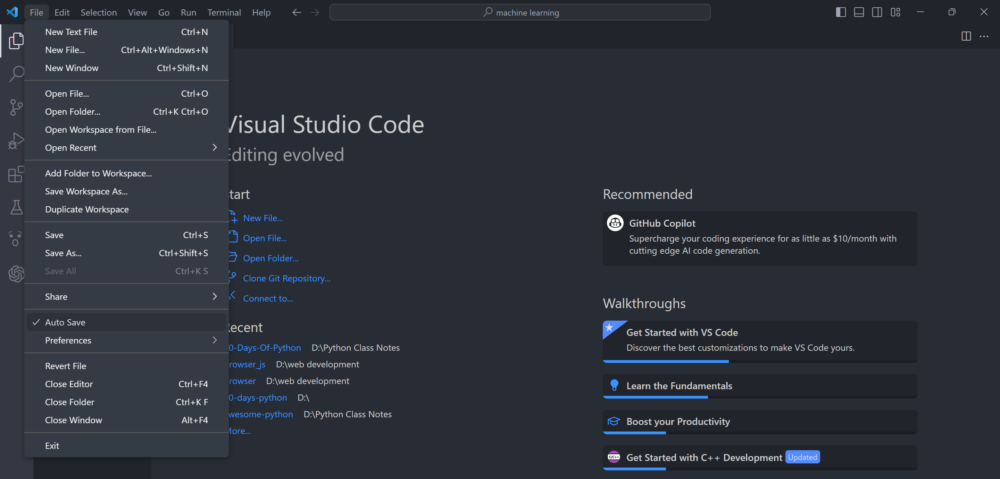
**Step 8: create a new file with python extension `.py` type your code and click Run Python file, for the first time it will ask to set the python interpreter, choose the python interpreter you downloaded then run your file.**
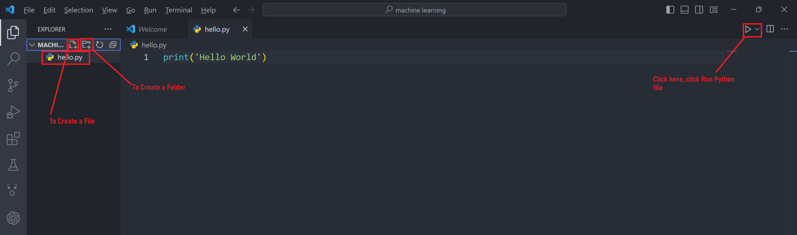

The outputs are shown in the terminal, to open a terminal in VScode use the shortcut: 
```shell
ctrl + `
```


#### How to Download and Install Pycharm IDE:
-------------------------------------------
Code Editor: PyCharm provides a powerful code editor with features like syntax highlighting, code completion, code analysis, and code navigation. It supports a wide range of Python versions. 

Download the Pycharm Community Version From here https://www.jetbrains.com/pycharm/download/?section=windows

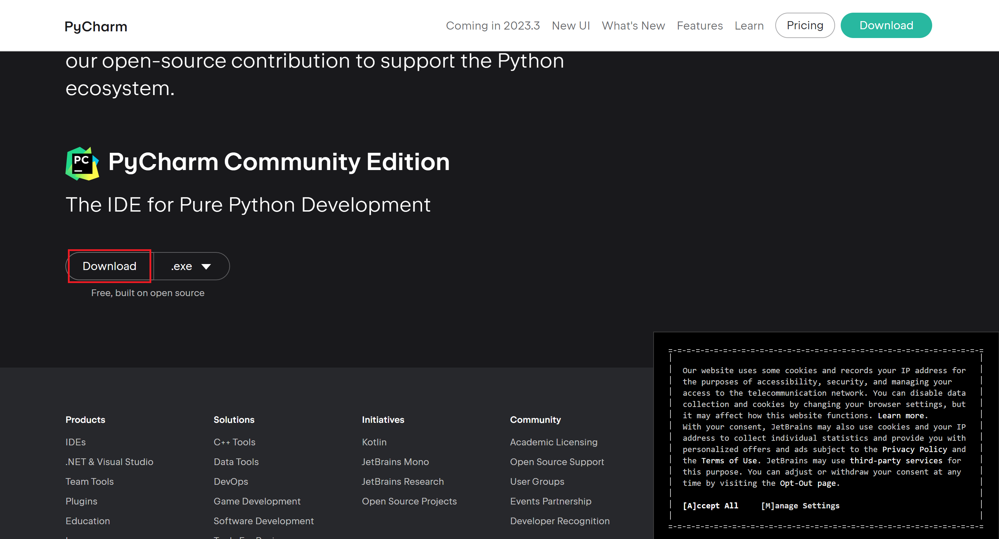

Now Open the Downloaded file and click next, follow the instructions to finish Download


The PyCharm executable will be added to the Start Menu and desktop (if selected).

**Note: Restart is required if you enable the PATH variable.**

After Installation, Open the pycharm IDE, click on the New Project, Now Select the Location of your Project Directory and set the Base Interpreter to python3, which you previously installed on the system and click the create button

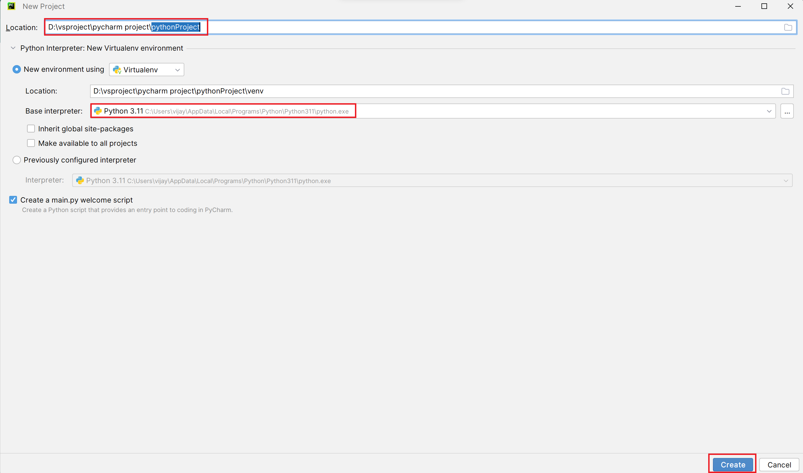

Now the Project Folder will Opened with python file `main.py` initially it will come with sample condings, clear all the scripts, set the Run main to current file and start to code


# 

